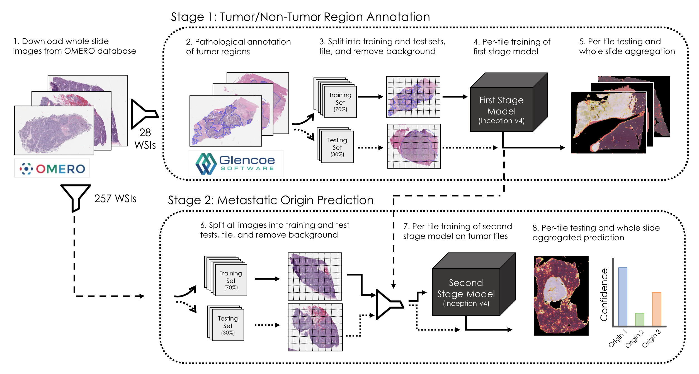

# Neural Estimator of Metastatic Origin

Geoffrey F. Schau, Erik A. Burlingame, Guillaume Thibault, Tauangtham Anekpuritanang, Ying Wang, Joe W. Gray, Christopher Corless, Young Hwan Chang, "Predicting Primary Site of Secondary Liver Cancer with a Neural Estimator of Metastatic Origin (NEMO)"

You can read the initial preprint on bioRxiv [here](https://www.biorxiv.org/content/10.1101/689828v1)



## Overview

Pathological inspection of stained biopsy tissue remains a gold-standard process for the diagnosis of various types of cancer and other malignancies. 
In the case of metastatic cancer that has spread from beyond the primary site and to distal organ systems, histopathological assessment of biopsies can provide essential information to best guide diagnosis and treatment options for the patient.

This study sought to evaluate whether deep learning systems are capable of distinguishing the metastatic origin of whole-slide histopathological images taken from biopsies of liver metastases.
We present a two-step approach that first trains a model to identify regions of tissues that contain cancerous mass and filter out normal liver, necrosis, and stromal tissue from the training set.
After the learned first model is applied to the entire dataset, we then train a second-stage model to correctly classify regions of tissue according to their metastatic origin which in our dataset originates from one of three classes: gastrointestinal stroma, neuroendocrine carcinomas, or adenocarcinomas. 
Finally, we compare our model's performance to that of three board-certified pathologists and illustrate that our model achieves competitive performance in this task.

In this study, we utilize the [inception v4](https://github.com/kentsommer/keras-inceptionV4/blob/master/inception_v4.py) learning architecture.


## Stage 1: Tumor/Non-Tumor Region Classification

The first stage model is designed to learn to correctly classify regions of whole slide images as either tumor tissue or normal liver or stroma. 

### Pathological Annotations

Pathological annotations of tumor/non-tumor regions were provided by an expert pathologist through a secure instance of an OMERO server containing relevant images.
All annotations are downloaded and stored as binary mask files for downstream data parsing, and are accessed with a simply utility script.

```bash
python src/get_annotations.py
```

### Preprocessing

Whole slide images are first loaded and tiled into non-overlapping patches of 299x299 pixels.
White background tiles are removed with a mean intensity threshold cutoff, and remaining tiles are normalized with an established method of histopathological color intensity normalization, included [here](https://github.com/schaugf/HEnorm_python).
Slides can be preprocessed individually or in parallel on a slurm-equipped computing cluster.
In each case, the preprocessing routine tiles the whole slide image, stores them as an 8-bit numpy tensor, and generates a per-tile binary target indicating whether the tile is in the annotated tumor region or not which are used as the target variable for the binary classification learning task. 

```bash
python src/stage1_preprocess.py --slide_file
sbatch run/stage1_preprocess.submit
```

### Data Splitting

Next, whole slide images are randomly partitioned into training (70%) and testing (30%) sets.
As each image is randomly assigned, composite training and testing tensors are generated and stored by concatenating the individual WSI tensors and label files.

```bash
python src/stage1_sort.py
```

### Training

Once training and testing tensors are generated, training may begin. We utilize a bank of NVIDIA V100 GPUs available through the OHSU Exacloud computing cluster which are requested through a slurm job submission.

```bash
python src/stage1_train.py
sbatch run/stage1_train.submit
```

### Evaluation

Once trained, the model is deployed on both training and test sets to evaluate expected performance as we apply it to the entire dataset.

```bash
python src/stag1_evaluate.py
sbatch run/stage1_evaluate.submit
```

Per-tile predictions are stitched back together to generate spatially registered predictions of tumor/non-tumor regions, as illustrated in this example where the model correctly identifies the small tumor region within normal liver. 

 

Zooming in, we can readily identify tumor regions being lit-up by the model's predictions as opposed to the darker surrounding normal liver structure.


## Stage 2: Metastatic Origin Prediction

The second stage of this approach requires first applying the learned first-stage model to the remaining dataset and then filtering out tiles from every whole slide image predicted to be of non-cancerous tissue and then learning a second model to correctly classify the metastatic origin of the tumor tissue given a training set that includes clinical determinations of metastatic origin confirmed by immunohistochemistry staining.

### Preprocessing

Preprocessing is similar to Stage 1 with the additional filter provided by the learned stage 1 model. 

```bash
python src/stage2_preprocess.py --slide_file
sbatch run/stage2_preprocess.submit
```

As before, this script stores a numpy array of tiles for each whole slide image in the dataset as well as a csv metadata file containing the coordinates of each tile.

### Data Splitting

Once more, the entire set of whole slide images are split into training and test sets, concatenating numpy tensors into either training or test sets as well as the csv metadata files to retain complete information about each tile.

```bash
python src/stage2_sort.py
```

### Training

A new model is instantiated and trained to correctly predict the metastatatic origin of each tile in the training set. As before, the inception v4 learning architecture is employed with a softmax activation at the output layer that enables a probabalistic interpretation of the model's output.

```bash
python src/stage2_train.py
sbatch run/stage2_train.submit
```

### Evaluation

Once trained, the learned model is deployed on all tile stacks from all images in the dataset. For each tile stack in a whole slide image, a composite prediction is generated across all tiles which is taken to be the whole slide prediction. The evaluation routine compares the whole slide metastatic origin prediction against the clinically-determined metastatic origin provided by the health record database to estimate the model's out-of-sample generalizability error.

```bash
python src/stage2_evaluate.py --slide_file
sbatch run/stage2_evaluate.py
```

#### Pathologist Comparison Study

Lastly, we compared out model's performance to that of three-board certified pathologists given the same held-out testing dataset and asked to infer metastatic origin strictly from tissue morphology in the H&E images. As we illustrate in our paper, the learned model's performance is comperable to the human pathologists, though in a limited setting and without additional tests used to confirm diagnoses clinically. 


